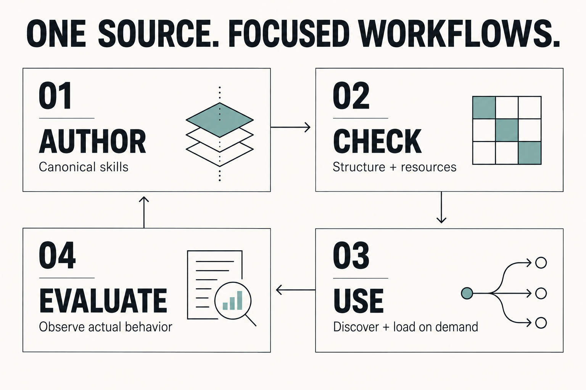

# AI Skills

Reusable workflows for coding agents, maintained in one canonical repository and loaded when the task needs them.

My working library of engineering, review, orchestration, and maintenance skills—plain instructions, practical helpers, and checks that keep them honest.

[Quick start](#quick-start) · [Skill catalog](#skill-catalog) · [How it works](docs/architecture.md) · [Authoring & validation](docs/authoring.md)

<picture>
  <source media="(max-width: 600px)" srcset="docs/assets/skill-lifecycle-mobile.svg">
  <source media="(prefers-color-scheme: dark)" srcset="docs/assets/skill-lifecycle-dark.png">
  <source media="(prefers-color-scheme: light)" srcset="docs/assets/skill-lifecycle-light.png">
  
</picture>

**Author → check → use → evaluate.** A skill is a folder containing a `SKILL.md` entrypoint and, when useful, scripts, references, and assets. Structural checks validate the package; observed agent behavior tells us whether the workflow works.

## Quick start

From a checkout of this repository, use Python **3.12+**:

```powershell
python -m pip install PyYAML
python skills/skill-doctor/scripts/skill_doctor.py .
```

Then pick a skill below and read its entrypoint. To use it in an agent, install the complete folder into that host's supported skill location. In Codex, for example: `Use $clean-code to simplify this function while preserving behavior.` See [discovery and profile setup](docs/architecture.md#discovery-and-profiles) for supported roots and a read-only sync preview.

To create or edit a skill, work under `skills/`, supply its UI metadata, then refresh the catalog and check it:

```powershell
python scripts/build-docs.py
python skills/skill-doctor/scripts/skill_doctor.py .
python scripts/sync-discovery.py --check
python -m unittest discover -s tests -v
```

The [authoring guide](docs/authoring.md) includes a minimal complete example. Discovery checking is read-only: a canonical-only checkout needs no repository copy, and the command says so. It checks parity if an optional Cursor copy exists.

## Skill catalog

Every canonical skill, alphabetically. Names come from `SKILL.md`; summaries come from `agents/openai.yaml`. Regenerate with `python scripts/build-docs.py`; the test suite rejects stale output.

<!-- skill-catalog:start -->
| Skill | Purpose |
| --- | --- |
| [address-pr-feedback](skills/address-pr-feedback/SKILL.md) | Address actionable GitHub feedback |
| [andromeda-ssh](skills/andromeda-ssh/SKILL.md) | Connect to and safely administer Andromeda |
| [api-docs](skills/api-docs/SKILL.md) | Document public C# APIs accurately |
| [clean-architecture-code](skills/clean-architecture-code/SKILL.md) | Write code with clean boundaries |
| [clean-architecture-review](skills/clean-architecture-review/SKILL.md) | Review code for architecture drift |
| [clean-code](skills/clean-code/SKILL.md) | Write and refactor pragmatic clean code |
| [clean-code-review](skills/clean-code-review/SKILL.md) | Review defects and design opportunities |
| [create-pull-request](skills/create-pull-request/SKILL.md) | Create GitHub pull requests |
| [explain](skills/explain/SKILL.md) | Explain code changes with a sequence diagram |
| [generate-unit-tests](skills/generate-unit-tests/SKILL.md) | Add focused, maintainable unit tests |
| [generic-loop](skills/generic-loop/SKILL.md) | Run bounded write and independent review cycles |
| [git-push](skills/git-push/SKILL.md) | Commit and push all pending changes on request |
| [independent-reviewer](skills/independent-reviewer/SKILL.md) | Request a fresh, read-only subagent review |
| [leetcode](skills/leetcode/SKILL.md) | Solve and review coding interview problems |
| [little-helper](skills/little-helper/SKILL.md) | Delegate one tightly scoped job to a subagent |
| [opencode-muse-spark](skills/opencode-muse-spark/SKILL.md) | Delegate scoped tasks to Muse Spark via OpenCode |
| [recommend-model-effort](skills/recommend-model-effort/SKILL.md) | Choose the right reasoning effort for a task |
| [remove-agent-skill](skills/remove-agent-skill/SKILL.md) | Remove a skill from all agent tools |
| [remove-slop](skills/remove-slop/SKILL.md) | Clean AI artifacts without behavior changes |
| [run-change-checks](skills/run-change-checks/SKILL.md) | Run focused checks for changes |
| [skill-doctor](skills/skill-doctor/SKILL.md) | Validate and audit a skills repository |
| [software-engineering-graph](skills/software-engineering-graph/SKILL.md) | Orchestrate rigorous application delivery |
| [sync-agent-skills](skills/sync-agent-skills/SKILL.md) | Sync user-profile skills without repository copies |
| [sync-agents-md](skills/sync-agents-md/SKILL.md) | Audit and reconcile agent instructions |
| [word-documents](skills/word-documents/SKILL.md) | Create and verify .docx files |
<!-- skill-catalog:end -->

Looking for `loop` or `code-review`? They are now `generic-loop` and `clean-code-review` to avoid built-in command collisions. See the [migration record](docs/migrations/skill-name-collisions-20260926.md).

## How it works

| Piece | Responsibility |
| --- | --- |
| [`skills/`](skills/) | Canonical skill folders. Edit these rather than installed copies. |
| `SKILL.md` | Short selection metadata followed by workflow instructions. |
| `agents/openai.yaml` | Display name, catalog summary, invocation prompt, and optional icons. Required here; not part of the portable minimum. |
| `scripts/`, `references/`, `assets/` inside a skill | Deterministic helpers and task-specific supporting material. |
| [`AGENTS.md`](AGENTS.md) | Shared profile guidance, also used as the default source by `sync-agents-md`. |
| Installed profiles | Copies used by each agent host; updated through the profile sync workflow. |
| Optional `.cursor/skills/` | Explicitly generated project discovery copy. This checkout does not ship one. |

The portable file format is shared by Codex, Cursor, Claude Code, and other Agent Skills clients. **Discovery paths, tools, and execution capabilities remain host-specific.** Some skills require PowerShell, GitHub access, document tools, or subagent support. Read the [compatibility notes](docs/architecture.md#discovery-and-profiles) before installing.

**Software Engineering Graph** goes beyond an ordinary instruction skill: it bundles a coordination engine, role profiles, schemas, and tests. A supervisor runs an approved plan with bounded design and delivery loops. The engine records state and evidence; the host dispatches agents. Start with its [overview](skills/software-engineering-graph/README.md), not an unplanned graph run.

## Create a skill

1. Choose one repeatable capability and a name that does not shadow host commands.
2. Write a brief description that distinguishes when the skill applies. Keep tool recipes in the body.
3. Keep the entrypoint lean. Link deeper references at the point they become relevant; add scripts for repeatable operations and gotchas from actual failures.
4. Add `agents/openai.yaml`, regenerate the catalog, and run the checks. Evaluate routing or workflow changes with realistic requests.

Use an installed `skill-creator` if available, or follow the [complete local example](docs/authoring.md#create-or-edit-a-skill). No scaffolder is required.

## Quality gates

| Check | What it establishes |
| --- | --- |
| [Skill doctor](skills/skill-doctor/SKILL.md) | Skill schema, metadata, resources, Python syntax, catalog membership, and optional copy parity. |
| [Documentation check](docs/authoring.md#prevent-catalog-drift) | Generated catalog freshness; local documentation links, anchors, and image paths. |
| [Discovery check](docs/architecture.md#optional-project-discovery-copy) | Optional Cursor copy parity, or an explicit report that no copy is configured. |
| Repository unit tests | Repository helper behavior and documentation drift regression checks. |
| [Behavioral scenarios](tests/behavioral/README.md) | Live selection, authorization, actions, and results in isolated workspaces. Separate from unit tests. |

Passing deterministic checks does **not** establish semantic review quality or reliable model behavior. Nested skill suites and live evaluations have separate procedures in the [validation guide](docs/authoring.md#validation).

## Go deeper

- [Architecture, discovery, and synchronization](docs/architecture.md): source ownership, host boundaries, and how copies reach profiles.
- [Authoring, validation, and maintenance](docs/authoring.md): examples, quality gates, and visual maintenance.
- [Documentation audit and sources](docs/documentation-audit.md): findings, decisions, research dates, and validation limits.
- [Graph migration](docs/migrations/software-engineering-graph-20260906.md): preserved source history and inventory.
