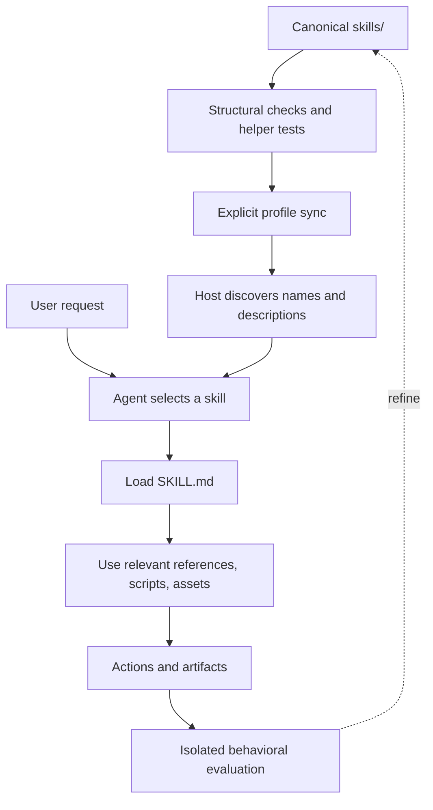

# Architecture, discovery, and synchronization

For people installing or maintaining this library. [Back to the README](../README.md).

## One source, separate installations

`skills/` is the maintained source. An installed profile holds the copy an agent discovers. Updating the source does not update an already installed copy or prove that a running session has loaded it.



This is the maintenance lifecycle, not an automatic pipeline. Humans or agents run checks and authorized syncs. The host discovers installed metadata; a matching request causes the instructions and needed resources to be loaded. Behavioral evaluations inspect actions and artifacts and feed changes back into the source.

The [Agent Skills specification](https://agentskills.io/specification) defines the portable package. Here the local schema deliberately requires only `name` and `description` in frontmatter, plus `agents/openai.yaml`. The broader specification allows additional fields; this repository's validator is not a universal conformance checker.

## Source ownership

| Location | Owner and purpose |
| --- | --- |
| `skills/<name>/SKILL.md` | Canonical routing description and workflow. |
| `skills/<name>/agents/openai.yaml` | Host UI metadata; `short_description` also supplies the generated README summary. |
| Skill-local `scripts/`, `references/`, `assets/`, `tests/` | Only the resources needed by that skill. Copy the complete skill folder. |
| Root `scripts/` and `tests/` | Repository maintenance and regression checks. |
| Root `AGENTS.md` | Portable shared instructions. `sync-agents-md` uses it as the default source while preserving target-specific guidance. |
| `docs/migrations/` | Historical evidence; old paths and commands describe the recorded snapshot, not current setup instructions. |
| User profiles | Agent-discoverable installations, synchronized separately. |

`software-engineering-graph` is maintained directly in this repository. Its [migration record](migrations/software-engineering-graph-20260906.md) preserves provenance; it is no longer an external installation pointer. If a future skill carries `external-source.json`, the sync helper resolves that declared source and records the installed revision. Ordinary skill use does not authorize upstream updates.

## Discovery and profiles

These are supported locations documented by the respective hosts, checked on 2026-09-26. They are not a claim that every workflow runs unchanged in every host.

| Host | Relevant discovery locations | Practical boundary |
| --- | --- | --- |
| [Codex](https://learn.chatgpt.com/docs/build-skills) | `~/.agents/skills/` for shared user skills; `.agents/skills/` for project skills | This library uses profile installation. Codex UI metadata does not provide missing tools or permissions. |
| [Cursor](https://cursor.com/docs/skills) | `~/.agents/skills/` and `~/.cursor/skills/` locally; `.agents/skills/` and `.cursor/skills/` in projects | Personal Cloud sync covers `~/.cursor/skills/`, not `~/.agents/skills/`. Remote availability requires separate setup. |
| [Claude Code](https://code.claude.com/docs/en/skills) | `~/.claude/skills/` personally; `.claude/skills/` in projects | Local personal skills do not automatically reach cloud sessions. Use Claude's supported account or project distribution. |
| [VS Code/Copilot](https://code.visualstudio.com/docs/agent-customization/agent-skills) | Personal `~/.agents/skills/`, `~/.claude/skills/`, `~/.copilot/skills/`; corresponding supported project roots | Current versions support the shared root directly. `doctor-vscode` inspects legacy Local-agent flags, not current harness discovery. |

The canonical `skills/` directory is source storage, not a promise of automatic host discovery. For Codex and local Cursor, install shared skills once in `~/.agents/skills`; keep Cursor-only skills separate. Invocation syntax differs: Codex supports `$skill-name`, while Claude Code and Cursor expose skills through their own command interfaces. Refer to the host documentation above.

The [current sync workflow](../skills/sync-agent-skills/SKILL.md) updates **user profiles only**. It does not scan consumer repositories/worktrees or regenerate project copies. From the source repository, preview a single skill installation without writing:

```powershell
python skills/sync-agent-skills/scripts/sync_agent_skills.py sync-from-master --master . --target-root (Join-Path $HOME '.agents/skills') --skill clean-code --all
```

`--all` permits including a skill not already installed; `--skill` limits this preview to `clean-code`. To apply an intended copy, use the same command with `--apply`; replacing a differing target also needs `--force`. The helper retains backups by default; use `--backup-root` for an explicit location outside discovery roots. Review the preview and the skill's full instructions before a profile update. No profile changes are part of documentation validation.

For diagnosis, compare a profile with the canonical tree:

```powershell
python skills/skill-doctor/scripts/skill_doctor.py . --profile-root (Join-Path $HOME '.agents/skills')
```

Parity checks compare files. They do not establish that a live host selected the intended copy. Use the [Codex discovery procedure](../skills/sync-agent-skills/references/codex-discovery.md) when runtime loading is in doubt.

## Optional project discovery copy

This checkout intentionally has no `.cursor/skills/` or `.agents/skills/` mirror. The former committed Cursor copy duplicated the canonical tree. Profile-only synchronization must not restore it.

The standalone `scripts/sync-discovery.py` remains available for an **explicitly requested** project-copy workflow. Running it without `--check` creates or refreshes ordinary files under `.cursor/skills/` and records managed paths in `.cursor/sync-discovery-manifest.json`. This is separate from profile sync; it is not an onboarding prerequisite.

```powershell
python scripts/sync-discovery.py --check
```

With no copy and no manifest, this reports a canonical-only checkout and creates nothing. With a copy, it reports missing, extra, or changed files. A manifest without its copy is incomplete and fails validation. Refreshing a copy preserves unknown files and graph runtime data; it can remove stale files previously owned by the manifest. Review destination changes before an explicit refresh.

## Ordinary workflows and orchestration

| Need | Entry point | Difference |
| --- | --- | --- |
| A focused capability | The matching skill in the [catalog](../README.md#skill-catalog) | Instructions plus optional helpers; no orchestration by default. |
| One precisely specified helper job | [little-helper](../skills/little-helper/SKILL.md) | Bounded subagent task with an exact result and deadline. |
| A fresh second opinion | [independent-reviewer](../skills/independent-reviewer/SKILL.md) | Independent read-only review, not implementation. |
| Bounded write/review repair cycles | [generic-loop](../skills/generic-loop/SKILL.md) | One writer, fresh reviewers, durable candidate evidence, limited repairs. |
| Multi-role delivery | [software-engineering-graph](../skills/software-engineering-graph/README.md) | Approved plan, route selection, role contracts, ledger, independent gates. |

The graph engine is a deterministic coordination and recovery aid. It does not execute model agents or enforce a security sandbox. The host supplies dispatch capabilities. Runtime policy, ledgers, lessons, and artifacts belong in a sibling `<profile>.local/software-engineering-graph/` home or a configured absolute override, not tracked skill source. Read the graph's own instructions before a run; this overview does not replace its approvals or role contracts.

## Portability stops at capabilities

A shared `SKILL.md` format does not standardize SSH access, document renderers, model availability, subagent tools, account permissions, or cloud distribution. `andromeda-ssh` intentionally targets one host; `word-documents` has rendering requirements; delegation skills require host support.

Plugins can package skills with other host extensions, but this repository is a skill library, not an installable cross-host plugin bundle. Do not infer marketplace support from the portable file format. See the [Vercel skills overview](https://vercel.com/blog/agent-skills-explained-an-faq) and each host's documentation for distribution options.
